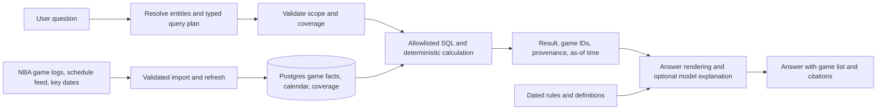

# StatLine: grounded NBA calendar and query architecture

**Status:** design proposal, 2026-09-28. No schema or runtime change is made by this document.

## Product contract

StatLine should answer a supported statistical question by selecting the right
games, calculating the requested statistic, and showing the games behind the
number. It should say when its data does not cover the question. The model may
interpret natural language and explain results; application code owns game
selection, arithmetic, and provenance.

StatLine should also know the published NBA calendar: upcoming games,
schedule changes, named event windows, designated event games, and milestones
such as the trade deadline. It imports that calendar as data each season.
Asking when Rivals Week occurs must work before any Rivals Week game is played;
asking how a player performed there requires completed games and box scores.

Initial statistical dimensions are player or league population, season or
career, game date or range, last N games, opponent, game type, and published
events with verified game IDs. The first release covers regular-season games
and the NBA Cup, including its separately sourced final; playoff coverage
follows the same schema after a separate source validation. The engine handles
comparisons and rankings. Initial metrics are points, rebounds, assists, made
and attempted field goals, and games played. Expand the metric catalog only
when the source contains enough fields to calculate the metric correctly.

Rules, tournament formats, and basketball terminology are a separate kind of
knowledge. Retrieve dated, attributed documents for explanations. Never use
document embeddings or model memory as the source of a numerical result.

## Evidence from the current project and source probe

- Today `backend/main.py` sends either the latest-five-game player summary or
  a PPG leaderboard to the model. `public.nba_chunks` stores text plus a
  vector. Neither is a complete game-level history, so the present `/ask`
  pipeline cannot calculate a career Christmas split or reliably isolate Cup
  games.
- On 2026-09-28, the installed `nba_api` `PlayerGameLogs` endpoint returned
  historical 1996-97 player rows with `GAME_ID` and `GAME_DATE`; Kobe Bryant's
  1996-12-25 game appeared. This is a feasibility check, not a claim of
  complete historical coverage. [PlayerGameLogs fields][player-logs]
- The 2025-26 `ScheduleLeagueV2` probe returned game ID, date, label,
  sublabel, and subtype. Its 67 labeled Cup games included group games,
  quarterfinals, semifinals, and a championship with game ID `0062500001`.
  `BoxScoreTraditionalV3` returned player rows for that championship.
  These fields must be validated season by season before relying on them.
  [Schedule fields][schedule] · [Box score fields][box-score]
- The NBA released its 2026-27 schedule on 2026-08-13. Its published key dates
  name Christmas Day, MLK Day, Rivals Week, the Cup, All-Star, and other
  calendar milestones. The release says two games per team remain unassigned
  until Cup Group Play resolves. [Schedule release][release] · [Key dates][key-dates]
- A 2026-09-28 probe of the 2026-27 machine-readable schedule found 12 games
  labeled `AWS NBA Rivals Week` and 67 labeled `Emirates NBA Cup`. The Rivals
  Week date window contains 38 total games. Five Christmas games appear on
  December 25 but have an empty `gameLabel`; the official release identifies
  those five as its Christmas slate. On MLK Day, seven games are scheduled,
  while the official nationally featured slate contains four. A label, a date
  window, and a featured slate are distinct game sets. [Schedule release][release]
- The NBA says the Cup championship does not count in regular-season
  statistics. A Cup answer must state whether it includes the championship.
  [NBA Cup FAQ][cup-faq]
- `nba_api` is a community client for NBA.com endpoints. Its maintainers note
  that NBA.com does not publish endpoint change notices. Public deployment
  requires a source-reliability and usage-rights review. [nba_api README][nba-api]

## Design review and revisions

| Candidate | What it solves | Failure in this use case |
| --- | --- | --- |
| More embedded player/time-window summaries | Narrative retrieval | Cannot guarantee an exact set of games, a correct denominator, or coverage of an unanticipated split. |
| Fetch NBA endpoints for every user question | Avoids an initial backfill | Career queries need many requests; latency, outages, and changing responses make answers hard to reproduce. |
| A large agent or analytical warehouse first | Broad future flexibility | Adds moving parts before the app can prove two basic historical/event queries. |
| **Versioned game facts in Postgres, a typed query tool, and a small explanation layer** | Exact filters, reproducible calculations, and inspectable evidence | Requires a controlled backfill and a coverage ledger; these become explicit build gates. |

The first pass was a live API plus model-selected filters. The source probe
showed that the Cup final is outside ordinary regular-season logs, and the
current five-game chunk format loses older dates. The revised design joins
schedule metadata to stored box scores by game ID, tracks which seasons are
complete, and returns calculations with their constituent games. A second
review added league-wide rankings, explicit source rights and coverage gates,
and a migration path that never routes an unsupported stat question back to
plausible but unrelated summary chunks. A third review added the NBA's
published calendar as a first-class import, with separate membership for
designated games and dates. Keep the existing Next.js UI and FastAPI service;
add a narrow data/query layer.

## Data flow



### Storage and provenance

Create a non-exposed Postgres schema accessed only by the FastAPI server:

| Relation | Essential fields and purpose |
| --- | --- |
| `players` | Stable NBA player ID, canonical name, aliases. |
| `games` | NBA game ID, official game date, season, season type, teams, scheduled/final status, raw schedule label/subtype, source timestamp. |
| `player_game_stats` | `(game_id, player_id)` key, team ID, played flag, PTS/REB/AST, FGM/FGA, other supported raw counts, source timestamp. |
| `calendar_events` | Season, league/competition scope, stable event family, official name and aliases, kind (`designated_games`, `date_window`, `milestone`, `competition`), start/end date, original source URL, published time, and verification state. New schedule labels become candidate events automatically. |
| `event_games` | Event ID, game ID, membership reason (`schedule_label`, `official_list`, or verified date rule), stage, source reference, and verification state. A date window does not automatically imply designated-game membership. |
| `schedule_revisions` | Fetch time, hash and retrievable raw snapshot of each published schedule version, added/moved/canceled/TBD game changes, and reconciliation result. |
| `coverage` | Source + season + dataset or event, sync time, expected/observed counts, `complete`/`partial`/`stale` state and failure reason. |
| `source_runs` | Endpoint/provider, fetched time, source version/hash, row count, validation result. |

Start with B-tree indexes on `player_game_stats(player_id, game_id)` and
`games(season, game_date)`, plus the game-ID keys used to join facts and event
memberships. Measure real queries with `EXPLAIN` before adding indexes. Keep existing
`nba_chunks` for dated explanatory
documents or phase it out after exact-stat routes are proven. Do not index
game facts as prose for numerical retrieval. Supabase recommends selecting
indexes from query patterns and checking the planner. [Supabase indexes][indexes]

The server's database connection remains private. If these tables are placed
in an exposed schema, enable RLS and review grants; a non-exposed schema is
the simpler fit for this server-only API. [Supabase RLS][rls]

### Import and refresh

1. Validate source fields, historical seasons, calendar labels, Cup stage
   labels, final box scores, quotas/latency, and usage rights before committing to a provider.
   Keep an adapter interface so the data source can change without rewriting
   query logic.
2. Import the season schedule and official key dates at release, then refresh
   revisions through the season. Use the game schedule for IDs and statuses,
   key dates for windows and milestones, and official event announcements for
   featured slates when needed. Preserve raw labels; automatically create
   candidate calendar events from new labels. Match labeled games by game ID.
   Normalize sponsor prefixes and prior names as search aliases while keeping
   the exact published label and source. Convert official date-only
   announcements into dated events; key-date entries for the G League, WNBA,
   or other competitions retain their own scope. When an official announcement specifies
   a featured subset, verify the exact
   game IDs from the schedule or published matchup list before marking that
   subset complete. Unverified extraction never becomes a factual event tag.
3. Backfill stats by season in bounded batches. Import all-player regular-season
   game logs, schedule metadata, and separately tagged championship box scores.
   Use idempotent upserts keyed by NBA game and player IDs. Record incomplete
   seasons rather than treating missing games as zero.
4. Refresh the active season daily and recheck recent finalized games for
   corrections. Keep the last verified snapshot through an outage, mark it
   stale, and display its as-of time. Do not silently switch to a different
   season when a source request fails.
5. Reconcile counts and joins: duplicate IDs, DNP rows, missing schedule
   matches, labeled-event counts, official featured slates, missing Cup stages,
   unavailable championship box scores, and aggregate totals against source
   leaderboards. Expand historical coverage gradually; unsupported years
   return a coverage notice.

The calendar importer should discover newly published labels and dates each
season, not require a code change for each marketing name. Candidate events
from extracted text stay unverified until their dates or game membership match
the source. Membership still needs source-backed rules: `AWS NBA Rivals Week`
is the 12 designated
games, while “all games during Jan. 26–30” is the larger date-window set.
Christmas can use the official NBA game date after checking the announced
slate. A trade deadline is a dated milestone with no inherent game set.
Upcoming or TBD games are shown as schedule facts; player averages use only
completed, verified box scores.

The 2026-27 snapshot gives concrete contract tests. These counts are fixtures
for importer validation, not constants in application code:

| Question | Selected calendar facts |
| --- | --- |
| “When is Rivals Week?” | The official Jan. 26–30, 2027 event window. |
| “Which games are Rivals Week games?” | The 12 schedule-designated games. |
| “What NBA games happen during Rivals Week?” | All 38 scheduled games in that date window, with the 12 designated games identifiable. |
| “Who plays on Christmas?” | The five Dec. 25 games, verified against the NBA's published Christmas slate despite blank feed labels. |
| “Which games are the MLK Day featured slate?” | Four published featured games; the date contains seven total games. |
| “How did a player perform in 2027 Rivals Week?” | No completed-game statistic before those games are played; show the upcoming designated games. |

This is a refresh process, not a request-time crawl across a player's career.
An optional bounded background backfill can fill an older missing season, but
the current request should report that the answer is pending or unavailable.

### Query and answer contract

`/ask` first determines whether the user wants a calendar fact, a statistic,
an explanatory fact, or a combination. Statistical questions resolve names
and produce a typed `StatQuery` with allowed entities, population, metrics,
aggregation, ranking, and filters. Common
phrases can map directly; OpenAI strict function calling can fill the same
schema for varied wording. The backend validates IDs and enums, caps the
scope, and executes parameterized SQL. The model never writes SQL or chooses
a numeric result. A league ranking states its eligibility rule, including
any minimum games, rather than letting one appearance silently lead a list.
OpenAI documents strict tool schemas for this pattern.
[OpenAI function calling][function-calling]

Example plans, with player names resolved to IDs before execution:

```json
{"player":"Kobe Bryant","scope":"career","filter":{"calendar_day":"12-25"},"metrics":["PTS","REB","AST"],"aggregate":"per_game"}
{"player":"LeBron James","scope":"career","filter":{"event":"nba_cup","stages":"all"},"metrics":["PTS","REB","AST"],"aggregate":"per_game"}
```

Define “NBA Cup” as all verified Cup stages by default, including its final;
state that choice next to the answer. A user can request group play only, a
specific year, or regular-season-counting Cup games. The final is imported
from a separate box score and is never folded into a regular-season average.
If a phrase has more than one plausible interpretation, show the assumed
scope or ask a short clarifying question before calculating.

For an event question, the plan records `event_id`, `season`, and
`membership=designated_games|all_games_in_window`. “During Rivals Week”
defaults to the NBA-designated event games and says so. “All games that week”
uses the full date window. “When is Rivals Week?” reads `calendar_events`
without requiring game stats. An event with only a date range cannot be
silently treated as an officially designated slate.

The query result contains metric values, raw totals, denominator, exact
selected game IDs and dates, filter definition, source endpoint, coverage
state, and as-of time. This result is an explainable trace: the UI can show
how the player/event was resolved, which games qualified, and the formula.
PPG means total points divided by games played, not scheduled games or DNPs.
FG% means `sum(FGM) / sum(FGA)`, not the mean of game percentages. Other
derived metrics require documented formulas and missing-data rules. The API
builds the numeric sentence or validates every model-produced number against
this result. Citations link to game rows and, when appropriate, a rules source.
There is no citation added merely because the model omitted one. The current
`generate_answer` behavior that appends source IDs after an uncited response
must be removed when this route ships; it does not establish claim support.

### Example answer paths

**Kobe on Christmas:** resolve Kobe's ID; check career season coverage; select
his played games whose official NBA game date is December 25; calculate totals
and per-game averages; list the matching dates, games, count, and coverage.
If a historical season is missing, do not claim a career average.

**LeBron in the in-season tournament/NBA Cup:** resolve LeBron's ID; join his
games to verified Cup game IDs across supported Cup seasons; include or
exclude the separately sourced championship according to the stated scope;
calculate from the selected player rows; cite those rows and the event rule.
If the event metadata or final box score is incomplete, report partial
coverage instead of a complete Cup average.

**“Who led the league in points last month?”** select the stated date window,
aggregate each eligible player's played games, apply and disclose a minimum
games rule, then rank from calculated values. This uses the same game facts as
the named-player questions.

**“Why is Christmas important?”** route to dated, attributed explanatory
documents. A mixed question can retrieve both rules/history text and an
exact stats result. Numerical claims still come from the query tool.

**“How did a player do in Rivals Week?”** resolve the published season's
`AWS NBA Rivals Week` event, select only verified designated game IDs, then
join completed player box scores. Before those games are played, show the
upcoming schedule and say that performance statistics are not available yet.

## Delivery plan and gates

1. **Source and calendar coverage spike.** Save fixtures for two Kobe Christmas
   seasons, every Cup stage in one season and its final, and the released
   2026-27 calendar. Verify game-ID joins, official dates, DNP behavior,
   endpoint reliability, and source terms. Gate: exact expected game sets are
   enumerated for Christmas, Cup, the 12 designated Rivals Week games versus
   the 38-game date window, and the four featured MLK games versus all seven
   games on MLK Day.
2. **Calendar and game-fact foundation.** Add a reviewed migration, schedule
   revision importer, stats import job, coverage ledger, and small backfill.
   Gate: rerunning import is idempotent; new official labels surface without a
   code change; an unlabeled Christmas slate is matched through its verified
   date/source; failed feeds preserve verified data with a visible stale state;
   season/game counts reconcile against the source.
3. **Typed stats and calendar engine.** Implement calendar-day, date-range,
   season, last-N, opponent, and event filters with exact aggregates and
   source rows. Answer schedule dates and matchups from published calendar
   facts. Keep current recommendations. Gate: fixture tests assert selected
   game IDs, denominator, PPG, and weighted FG%, including Cup-final and
   designated-event boundaries; future games never contribute stats.
4. **Natural-language routing and UI.** Route numeric questions through the
   typed tool, knowledge questions through attributed documents, and mixed
   questions through both. Show scope, included games, coverage, and as-of time
   in the answer UI. Put the route behind a feature flag during migration.
   Gate: paraphrases resolve to the same query plan; unknown events and
   unsupported stats fail clearly without a made-up answer or fallback to
   unrelated `nba_chunks` text.
5. **Quality and operations.** Extend `evals/` with gold query plans, game-ID
   sets, exact values, multi-season and event cases, coverage failures, and
   source-outage cases. Track answer correctness, freshness, latency, and cost.
   Gate: all gold numeric results and cited game sets match the fixtures before
   enabling the new route by default.

This plan supports new questions through combinations of a bounded set of
dimensions and metrics. New event families still need a trustworthy way to
label games, and new statistics still need source fields and a definition.
Those are data-model extensions, not a hand-authored answer for every player
or phrase.

[player-logs]: https://github.com/swar/nba_api/blob/master/docs/nba_api/stats/endpoints/playergamelogs.md
[schedule]: https://github.com/swar/nba_api/blob/master/docs/nba_api/stats/endpoints/scheduleleaguev2.md
[box-score]: https://github.com/swar/nba_api/blob/master/docs/nba_api/stats/endpoints/boxscoretraditionalv3.md
[cup-faq]: https://www.nba.com/news/nba-cup-frequently-asked-questions
[nba-api]: https://github.com/swar/nba_api
[indexes]: https://supabase.com/docs/guides/database/postgres/indexes
[rls]: https://supabase.com/docs/guides/database/postgres/row-level-security
[function-calling]: https://developers.openai.com/api/docs/guides/function-calling
[release]: https://www.nba.com/news/2026-27-nba-regular-season-schedule
[key-dates]: https://www.nba.com/news/key-dates
